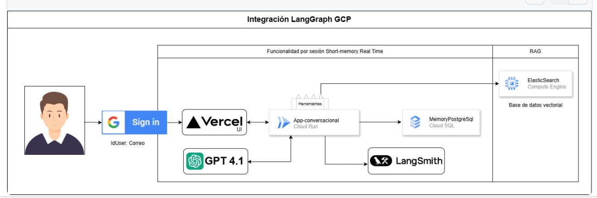

# POSTAGENT – IA ESPECIALIZADA EN POSTVENTA

## ⬇️ Contenido del repositorio

| Ruta | Descripción |
|------|-------------|
| `POSTAGENT_DATA_SAMPLE.ipynb` | Notebook Colab con todo el paso a paso para construir el agente. |
| `POSTAGENT_DATA_CARGA.ipynb` | Carga datos de prueba en base de datos vectorial Elasticsearch. |
| `datos_postventa.csv` | Datos de prueba para la base de datos vectorial - Datos de Pedidos. |
| `stock_productos.csv` | Datos de prueba para la base de datos vectorial - Datos de Stock. |
| `POSTVENTA-IA AGENTE.pptx` | Presentación de la solución. |
| `docs/` | Carpeta de arquitectura  |
| &nbsp;&nbsp;└ `POSTAGENT_ARQUITECTURA.PNG` | Arquitectura de la solucion. |
| `CloudRun/` | Carpeta con el microservicio listo para Docker ➜ Cloud Run |
| &nbsp;&nbsp;└ `app.py` | Código Python del agente (API `/agent`). |
| &nbsp;&nbsp;└ `Dockerfile` | Imagen multistage ligera. |
| &nbsp;&nbsp;└ `requirements.txt` | Dependencias congeladas. |

Plantillas FrontEnd (repos externos):

- Login con Google → <https://github.com/alexchanga/agentui-withlogin>  

---

## 🗺️ Arquitectura

